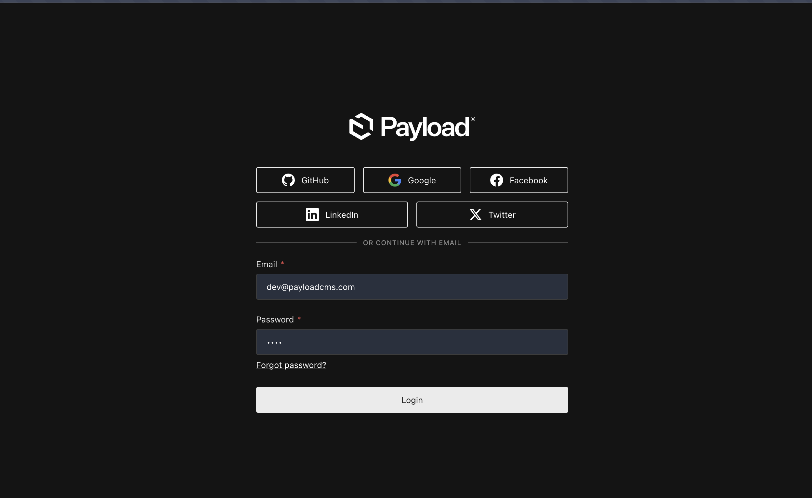
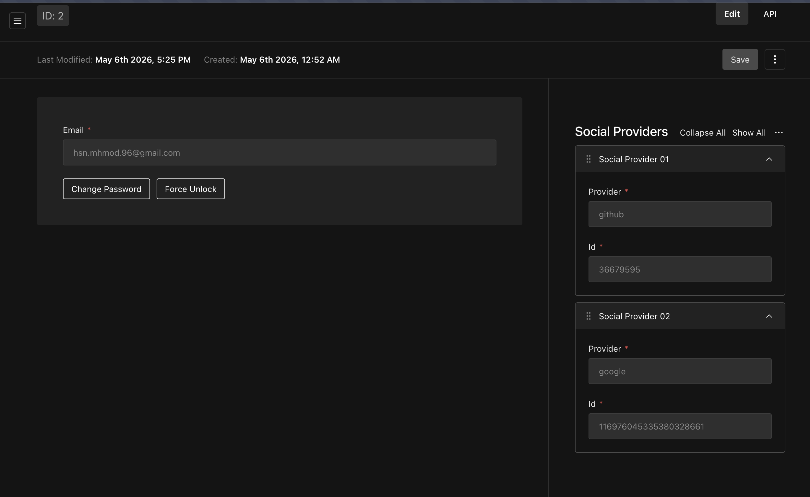

# Payload Social Auth Plugin

A modern, highly-polished, and fully-featured social authentication plugin for **Payload CMS** (v3) that enables seamless OAuth login with **GitHub**, **Google**, **Facebook**, **Twitter**, and **LinkedIn**.

[](https://www.npmjs.com/package/payload-social-auth)
[](https://github.com/Mhmod-Hsn/payload-social-auth/blob/main/LICENSE)
[](https://pnpm.io/)

---

## 📸 Screenshots

### 1. Beautiful Admin Sign-In Page
Featuring highly-polished, modern, and cohesive social login buttons that blend beautifully into Payload's dark/light modes:



### 2. Multi-Provider Linked User Accounts
Enables users to link multiple social identity providers seamlessly to a single user account:



---

## ✨ Features

- **Zero Configuration Buttons:** Automatically injects beautifully styled social login buttons (with pixel-perfect SVG icons) directly onto the Payload login screen.
- **Multiple Providers:** Full OAuth support for Google, GitHub, Facebook, Twitter, and LinkedIn.
- **Auto-User Provisioning:** Automatically provisions new Payload users upon successful social authentication.
- **Multi-Account Linking:** Links multiple social identities (e.g., Google and GitHub) to the same user account if they share the same email address.
- **Secure Session Management:** Native session-token cookie integration with customizable expiration, HttpOnly, Secure, and SameSite flags.
- **Type-Safe callbacks:** Customizable `onAuthSuccess` and `onAuthFailure` hooks for logging, onboarding flows, or analytics.

---

## 🚀 Installation

Install the package via your preferred package manager:

```bash
pnpm add payload-social-auth
# or
npm install payload-social-auth
# or
yarn add payload-social-auth
```

---

## 🛠️ Usage

Simply import and add the plugin to your Payload configuration (`payload.config.ts`):

```typescript
import { buildConfig } from 'payload';
import { socialAuthPlugin } from 'payload-social-auth';

export default buildConfig({
  // ... your existing config
  plugins: [
    socialAuthPlugin({
      providers: {
        github: {
          clientId: process.env.GITHUB_CLIENT_ID!,
          clientSecret: process.env.GITHUB_CLIENT_SECRET!,
        },
        google: {
          clientId: process.env.GOOGLE_CLIENT_ID!,
          clientSecret: process.env.GOOGLE_CLIENT_SECRET!,
        },
        // Add other providers as needed
      },
      jwtSecret: process.env.PAYLOAD_SECRET, // optional, defaults to Payload's secret
      cookieName: 'payload-token', // optional
      autoCreateUser: true, // optional, defaults to true
      onAuthSuccess: async (user, provider) => {
        console.log(`User ${user.id} logged in via ${provider}`);
      },
      onAuthFailure: async (error, provider) => {
        console.error(`Auth failed via ${provider}:`, error);
      }
    }),
  ],
});
```

---

## ⚙️ Configuration Options

| Option | Type | Default | Description |
|--------|------|---------|-------------|
| `disabled` | `boolean` | `false` | Enable/disable the plugin |
| `providers` | `object` | `{}` | Configuration object for social providers (`github`, `google`, `facebook`, `twitter`, `linkedin`) |
| `providers.[provider].clientId` | `string` | *Required* | OAuth client application ID |
| `providers.[provider].clientSecret` | `string` | *Required* | OAuth client application secret |
| `providers.[provider].callbackURL` | `string` | *Optional* | Custom callback URL |
| `providers.[provider].scope` | `string` | *Optional* | Custom OAuth scope string |
| `jwtSecret` | `string` | `payload.secret` | JWT secret used to sign session cookies |
| `cookieName` | `string` | `payload-token` | Custom authentication cookie name |
| `autoCreateUser` | `boolean` | `true` | Automatically create a new user if one does not exist |
| `onAuthSuccess` | `function` | `undefined` | Async callback triggered on successful login |
| `onAuthFailure` | `function` | `undefined` | Async callback triggered on failed login |

---

## 🔑 Social Provider Setup

To configure OAuth credentials, create client applications in each corresponding developer portal:

### 🐙 GitHub Setup
1. Visit [GitHub Developer Settings](https://github.com/settings/developers).
2. Register a new OAuth Application.
3. Configure **Authorization Callback URL** to: `https://your-domain.com/api/oauth/github`.
4. Copy your **Client ID** and generate a new **Client Secret**.

### 🔍 Google Setup
1. Go to the [Google Cloud Console](https://console.cloud.google.com/apis/credentials).
2. Create or select a project, then configure your OAuth Consent Screen.
3. Under **Credentials**, create an **OAuth 2.0 Client ID**.
4. Set **Authorized redirect URIs** to: `https://your-domain.com/api/oauth/google`.
5. Save and copy your **Client ID** and **Client Secret**.

### 📘 Facebook Setup
1. Visit [Facebook Developers Portal](https://developers.facebook.com/apps/).
2. Create a new App and add the **Facebook Login** product.
3. Navigate to Settings and configure **Valid OAuth Redirect URIs** as: `https://your-domain.com/api/oauth/facebook`.
4. Retrieve your **App ID** and **App Secret**.

### 🐦 Twitter Setup
1. Go to the [Twitter Developer Portal](https://developer.twitter.com/).
2. Create a Project and App with User Authentication settings enabled.
3. Set your Callback URI / Redirect URL to: `https://your-domain.com/api/oauth/twitter`.
4. Note down your **API Key** and **API Secret**.

### 💼 LinkedIn Setup
1. Visit the [LinkedIn Developer Portal](https://www.linkedin.com/developers/).
2. Create an App and associate it with a page.
3. Under the **Auth** tab, add your **Authorized Redirect URLs**: `https://your-domain.com/api/oauth/linkedin`.
4. Copy your **Client ID** and **Client Secret**.

---

## 🔒 License

Licensed under the [MIT License](LICENSE).